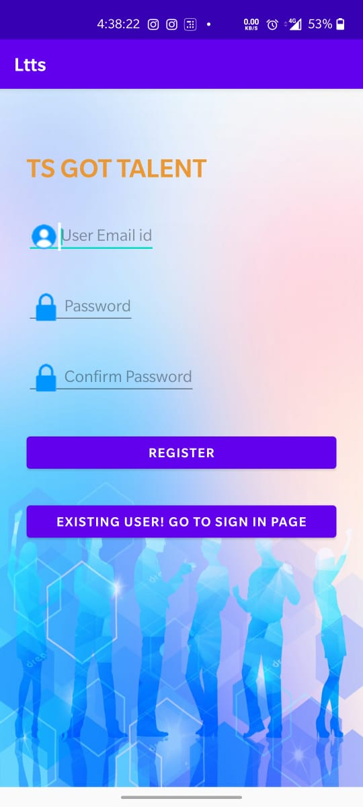
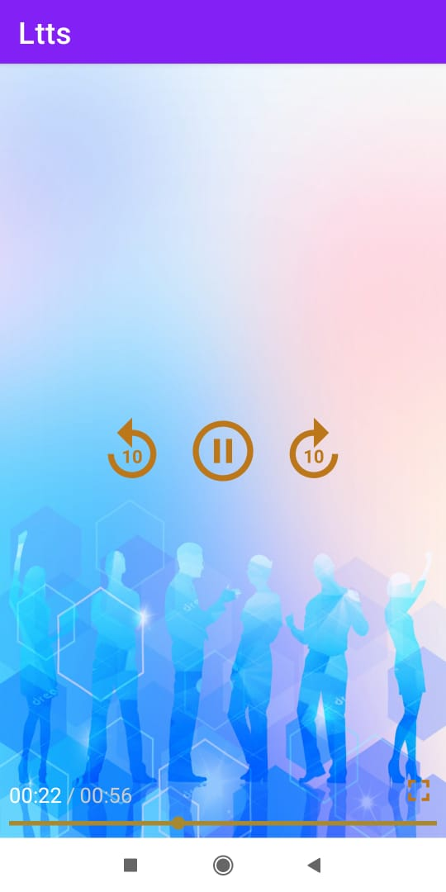

# TS Got Tallent
# Online APK link
https://appetize.io/app/vebgfudbv7jfbxuzj03wwda06c
# Name : NITHYA P
# Ps No. : 99002626

A simple  application created in android studio using Recycler View, ExoPlayer to play custom videos and YouTube API to fetch video of Dusshera events from YouTube. Features:- 1.Regisration and Login 2.Good UI 3.Glipmpse of various entries to the Talent Competition 'TS Got Talent' 4.Winners of the Competition 5. Categories of the Event

Technolgies used:
Java
XML
Android Studio
ExoPlayer

# Screenshots 

  
  
  
  
  
   

# Features:
     1.Registration and Login for Users
     2.Scrollable list of events (images) 
     3.YouTube video of Dusshera Events
     4.Glimpse of Events conducted

# Demo
[Click me to View Demo](https://user-images.githubusercontent.com/72501979/98433635-c38c7700-20ee-11eb-9e7f-358d30da4859.gif)

# API Used- 
YouTube API
